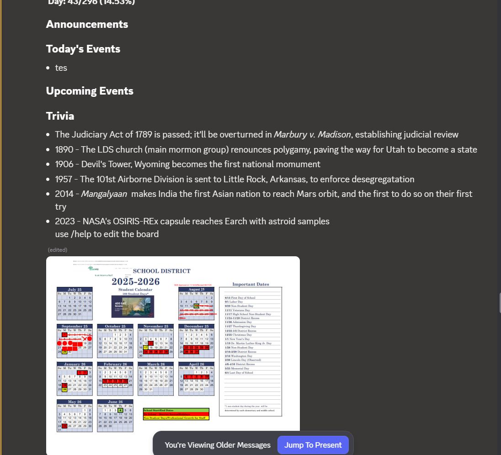
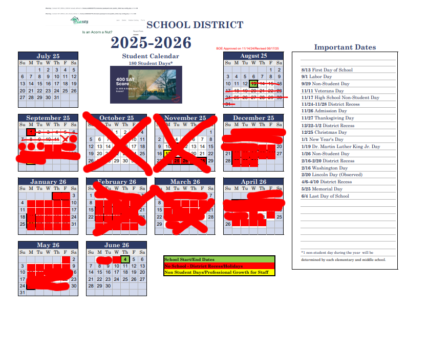

# The Countdown

Daily post in a Discord channel counting down the days from the start to the end of my senior year of highschool

The bot automatically marks up the calendar with a red square
 (admittedly the parts that are scribbled out in red are because i forgot to run the bot those days or drew an X over the month for no reason)